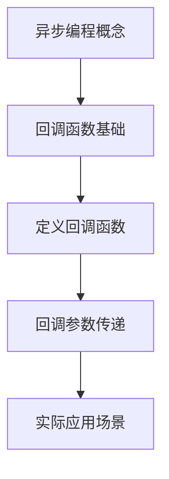

# WEB322_Week3-1_Asynchronous-Callbacks.md
## 异步编程与回调函数 | Asynchronous Programming & Callbacks

### 学习路径图 | Learning Path


### 目录 | Table of Contents
1. [异步编程概念](#异步编程概念--asynchronous-programming) 🟢
2. [回调函数基础](#回调函数基础--callback-functions) 🟢
3. [定义含回调的函数](#定义含回调的函数--defining-functions-with-callbacks) 🟡
4. [回调参数传递](#回调参数传递--adding-parameters) 🟡
5. [常见问题](#常见问题--faq) ❓
6. [实践示例](#实践示例--practice-examples) 💻
7. [学习建议](#学习建议--study-tips) 💡

---

### 异步编程概念 | Asynchronous Programming 🟢
- **定义 | Definition**  
  - 异步编程技术允许程序在长时间任务运行期间保持响应能力，无需等待任务完成即可处理其他事件  
  - Technique enabling programs to start long-running tasks while remaining responsive to other events without waiting for completion

- **核心特性 | Key Characteristics**
  - 非阻塞执行(Non-blocking execution)
  - 事件驱动架构(Event-driven architecture)
  - 提高资源利用率(Improved resource utilization)

- **示例 | Example**
  ```javascript
  console.log('开始任务');
  setTimeout(() => { console.log('长时间任务完成') }, 2000);
  console.log('继续其他操作');
  
  // 输出顺序: 
  // 开始任务
  // 继续其他操作
  // 长时间任务完成 (2秒后)
  ```

- 💡**实践提示 | Practice Tip**  
  - 适用于I/O操作、网络请求、文件处理等场景  
  - Ideal for I/O operations, network requests, file processing

---

### 回调函数基础 | Callback Functions 🟢
- **定义 | Definition**  
  - 回调函数是作为参数传递给另一个函数的函数，在外部函数完成特定操作后执行  
  - Function passed as argument to another function, executed after outer function completes operation

- **工作原理 | How It Works**
  ```mermaid
  sequenceDiagram
      主程序->>异步函数: 调用(含回调参数)
      异步函数->>主程序: 立即返回控制权
      异步函数-->>回调函数: 完成时触发
      回调函数->>主程序: 处理结果
  ```

- **示例 | Example**
  ```javascript
  function fetchData(callback) {
    // 模拟异步操作
    setTimeout(() => callback('数据获取成功'), 1000);
  }
  
  fetchData(result => console.log(result)); // 1秒后输出"数据获取成功"
  ```

---

### 定义含回调的函数 | Defining Functions with Callbacks 🟡
- **模式 | Pattern**
  ```javascript
  function asyncOperation(callback) {
    // 1. 执行异步任务
    // 2. 任务完成时调用callback()
  }
  ```

- **数据库连接示例 | Database Connection Example**
  ```javascript
  function connectToDatabase(callback) {
    const delay = Math.random() * 2000; // 随机延迟
    
    setTimeout(() => {
      console.log('数据库连接建立');
      callback(); // 连接成功后执行回调
    }, delay);
  }
  
  // 使用示例
  connectToDatabase(() => console.log('执行查询'));
  ```

- ⚠️**常见错误 | Common Mistake**  
  未等待异步操作完成就执行后续代码  
  Executing subsequent code without waiting for async operation

---

### 回调参数传递 | Adding Parameters 🟡
- **正确模式 | Correct Pattern**
  ```javascript
  function asyncOp(param, callback) {
    // 操作完成后
    callback(result); // 传递结果给回调
  }
  ```

- **数据库查询示例 | Database Query Example**
  ```javascript
  function connectToDatabase(query, callback) {
    setTimeout(() => {
      console.log(`执行查询: ${query}`);
      callback(`结果: ${query}`); 
    }, 1000);
  }
  
  // 使用示例
  connectToDatabase('SELECT * FROM employees', result => console.log(result));
  ```

- 💡**参数技巧 | Parameter Tip**  
  使用匿名函数传递额外参数：  
  Use anonymous functions for extra parameters:
  ```javascript
  connectToDatabase('SELECT * FROM products', 
                    (result) => handleResult(result, additionalParam));
  ```

---

### 常见问题 | FAQ ❓
1. **回调地狱是什么？如何避免？**  
   **What is callback hell? How to avoid?**  
   多层嵌套回调导致代码难以维护，可使用Promise/async/await解决  
   Deeply nested callbacks making code unmaintainable. Use Promises/async/await.

2. **回调函数总是异步执行吗？**  
   **Are callbacks always asynchronous?**  
   不一定，取决于父函数实现(callback可能同步或异步执行)  
   Not necessarily, depends on parent function implementation.

3. **如何处理回调错误？**  
   **How to handle errors in callbacks?**  
   遵循Node.js约定：callback(err, result)第一个参数传错误对象  
   Follow Node.js convention: first callback parameter for error

---

### 实践示例 | Practice Examples 💻
**场景：模拟数据库操作 | Scenario: Simulating Database Operations**
```javascript
// 1. 连接数据库
function connectDB(callback) {
  setTimeout(() => {
    console.log('数据库连接成功');
    callback(null, 'CONNECTION_ID');
  }, 1500);
}

// 2. 执行查询
function runQuery(connId, query, callback) {
  setTimeout(() => {
    console.log(`[${connId}] 执行查询: ${query}`);
    callback(null, [{id: 1, name: '产品A'}, {id: 2, name: '产品B'}]);
  }, 1000);
}

// 3. 整合操作
connectDB((err, connId) => {
  if (err) return console.error(err);
  
  runQuery(connId, 'SELECT * FROM products', (err, data) => {
    if (err) return console.error(err);
    console.log('查询结果:', data);
  });
});
```

---

### 学习建议 | Study Tips 💡
1. **理解事件循环机制**  
   JavaScript的事件循环是异步编程的核心，建议深入学习
2. **从简单示例开始**  
   先掌握单个回调，再逐步过渡到嵌套回调
3. **错误处理至关重要**  
   始终在回调中检查错误参数
4. **避免过度嵌套**  
   当回调超过3层时，考虑使用Promise或async/await重构

---

### 文档维护 | Document Maintenance
**更新日期**: 2025-09-12  
**版本号**: v1.0  
**更新内容**:  
- 添加异步编程与回调核心概念
- 包含参数传递最佳实践
- 完善实践示例和错误处理模式
