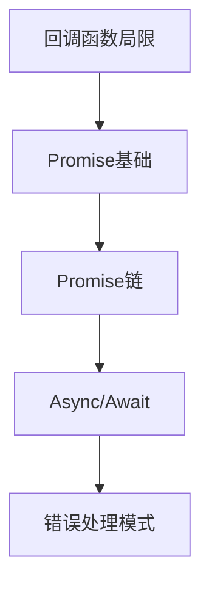

# WEB322_Week3-2_Promises-Async-Await.md
## Promise与Async/Await | Promises & Async/Await

### 学习路径图 | Learning Path


### 目录 | Table of Contents
1. [回调函数局限性](#回调函数局限性--callback-limitations) 🟢
2. [Promise基础](#promise基础--promise-fundamentals) 🟡
3. [Async/Await语法](#asyncawait语法--async-await-syntax) 🟢
4. [错误处理模式](#错误处理模式--error-handling-patterns) 🟡
5. [常见问题](#常见问题--faq) ❓
6. [实践示例](#实践示例--practice-examples) 💻
7. [学习建议](#学习建议--study-tips) 💡

---

### 回调函数局限性 | Callback Limitations 🟢
- **问题定义 | Problem Definition**  
  - 多层嵌套回调导致代码难以阅读和维护（回调地狱）  
  - Deeply nested callbacks cause code to be hard to read and maintain (callback hell)
  
- **示例 | Example**
  ```javascript
  // 传统回调嵌套示例 | Traditional nested callback example
  outputA(() => {
    outputB(() => {
      outputC();
    });
  });
  ```

- **主要缺点 | Main Drawbacks**
  - 代码可读性差(Poor readability)
  - 错误处理复杂(Complex error handling)
  - 难以扩展(Difficult to scale)

---

### Promise基础 | Promise Fundamentals 🟡
- **核心概念 | Core Concepts**
  ```mermaid
  stateDiagram-v2
    [*] --> Pending
    Pending --> Resolved: resolve()
    Pending --> Rejected: reject()
  ```

- **状态与方法 | States & Methods**
  - **Pending**: 初始状态，未完成也未拒绝  
    Initial state, neither fulfilled nor rejected
  - **Resolved**: 操作成功完成(Operation completed successfully)
  - **Rejected**: 操作失败(Operation failed)
  - **.then()**: 处理成功结果(Handle successful result)
  - **.catch()**: 处理错误(Handle errors)

- **基本模式 | Basic Pattern**
  ```javascript
  function asyncTask() {
    return new Promise((resolve, reject) => {
      // 异步操作 | Asynchronous operation
      success ? resolve(data) : reject(error);
    });
  }
  
  asyncTask()
    .then(data => console.log(data))
    .catch(error => console.error(error));
  ```

---

### Async/Await语法 | Async/Await Syntax 🟢
- **核心优势 | Key Advantages**
  - 使异步代码看起来像同步代码  
    Makes asynchronous code look synchronous
  - 消除回调嵌套(Eliminates callback nesting)
  - 更清晰的错误处理路径(Clearer error handling path)

- **基本语法 | Basic Syntax**
  ```javascript
  // 定义async函数 | Define async function
  async function fetchData() {
    try {
      const result = await asyncOperation(); // 等待Promise解决
      console.log(result);
    } catch (error) {
      console.error(error);
    }
  }
  ```

- **重要规则 | Important Rules**
  - `await`只能在`async`函数中使用  
    `await` can only be used inside `async` functions
  - async函数总是返回Promise对象  
    Async functions always return a Promise

---

### 错误处理模式 | Error Handling Patterns 🟡
- **Promise链错误处理 | Promise Chain Error Handling**
  ```javascript
  promiseChain()
    .then(step1)
    .then(step2)
    .catch(error => console.error(error)); // 捕获链中任何错误
  ```

- **Async/Await错误处理 | Async/Await Error Handling**
  ```javascript
  async function runTasks() {
    try {
      const A = await outputA();
      const B = await outputB();
      const C = await outputC();
    } catch (err) {
      console.error(err); // 捕获任何await错误
    }
  }
  ```

- **最佳实践 | Best Practices**
  - 始终处理拒绝状态(Always handle rejections)
  - 在async函数中使用try/catch(Use try/catch in async functions)
  - 避免未处理的Promise拒绝(Avoid unhandled promise rejections)

---

### 常见问题 | FAQ ❓
1. **Promise和Async/Await哪个更好？**  
   **Which is better: Promises or Async/Await?**  
   Async/Await是语法糖，底层基于Promise，两者可结合使用  
   Async/Await is syntactic sugar built on Promises, can be used together

2. **如何并行执行多个异步任务？**  
   **How to run multiple async tasks in parallel?**  
   使用Promise.all()  
   Use Promise.all()
   ```javascript
   Promise.all([task1(), task2(), task3()])
     .then(results => console.log(results))
   ```

3. **async函数返回值是什么？**  
   **What does an async function return?**  
   总是返回Promise对象，即使返回的是原始值  
   Always returns a Promise, even if returning primitive value

---

### 实践示例 | Practice Examples 💻
**场景：顺序异步任务处理 | Scenario: Sequential Async Tasks**
```javascript
// 1. 定义基于Promise的任务 | Define promise-based tasks
function taskA() {
  return new Promise(resolve => {
    setTimeout(() => resolve('A完成'), 1000);
  });
}

function taskB(prev) {
  return new Promise(resolve => {
    setTimeout(() => resolve(`${prev} → B完成`), 500);
  });
}

// 2. Async/Await实现 | Async/Await implementation
async function runSequence() {
  try {
    const resultA = await taskA();
    console.log(resultA);
    
    const resultB = await taskB(resultA);
    console.log(resultB);
  } catch (error) {
    console.error('任务失败:', error);
  }
}

runSequence();
```

---

### 学习建议 | Study Tips 💡
1. **先掌握Promise基础**  
   理解resolve/reject机制再学习async/await
2. **从简单链式调用开始**  
   先实现2-3个任务的链式调用
3. **善用Promise.all()**  
   并行独立任务提高执行效率
4. **始终处理错误**  
   避免未捕获的Promise拒绝

---

### 文档维护 | Document Maintenance
**更新日期**: 2025-09-12  
**版本号**: v1.0  
**更新内容**:  
- 添加Promise核心概念
- 包含Async/Await最佳实践
- 完善错误处理模式
