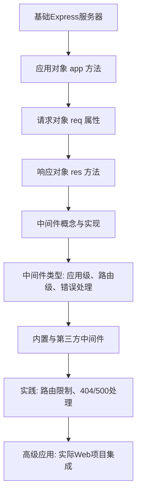

# WEB322 Week6 高级路由与中间件 (Advanced Routing and Middleware) 🟢🟡

## 标题和概述 (Title and Overview)
本周笔记聚焦Express.js中的高级路由、请求/响应对象以及中间件 (This week's notes focus on advanced routing, request/response objects, and middleware in Express.js)。  
这些概念构建在基础服务器基础上，帮助处理复杂HTTP请求、参数解析、错误处理和应用逻辑 (These concepts build on the basic server to handle complex HTTP requests, parameter parsing, error handling, and application logic)。  
通过学习这些知识点，您将能够构建更robust的Web应用 (By learning these, you can build more robust web applications)。

> Source: 来自两个网页的完整内容提取与总结 (Extracted and summarized from the two web pages: Application-Request-Response Objects and Middleware)。

## 学习路径图 (Learning Path)
使用Mermaid流程图展示学习顺序 (Using Mermaid flowchart to show learning sequence):



- 🟢 基础部分: App, Req, Res 对象 (Basic: App, Req, Res objects)。
- 🟡 中级部分: 基本中间件实现 (Intermediate: Basic middleware implementation)。
- 🔴 高级部分: 错误处理与第三方集成 (Advanced: Error handling and third-party integration)。

## 目录 (Table of Contents)
1. [应用对象 (Application Object)](#应用对象-application-object)
2. [请求对象 (Request Object)](#请求对象-request-object)
3. [响应对象 (Response Object)](#响应对象-response-object)
4. [中间件概述 (Middleware Overview)](#中间件概述-middleware-overview)
5. [中间件实现示例 (Middleware Implementation Examples)](#中间件实现示例-middleware-implementation-examples)
6. [中间件类型 (Types of Middleware)](#中间件类型-types-of-middleware)
7. [FAQ (常见问题)](#faq-常见问题)
8. [实践示例 (Practice Examples)](#实践示例-practice-examples)
9. [学习建议 (Study Tips)](#学习建议-study-tips)

## 知识点详解 (Detailed Content)

### 应用对象 (Application Object | app) 🟢
- 定义 | Definition  
  中文: Express.js的主应用对象，用于配置路由、中间件和视图引擎 (Chinese: The main Express.js application object for configuring routes, middleware, and view engines)。  
  英文: The "app" object represents the Express main application object. It contains methods for processing route requests, setting up middleware, and managing HTML views or view engines (English: From original source)。  

  > Source: The "app" object in the example above represents the express main application object. It contains several methods for tasks, such as processing route requests, setting up middleware, and managing html views or view engines.  

  💡 解析步骤 | Analysis Steps:  
  1. 关键词提取 | Key Terms: app, route, middleware, view engine (app, route, middleware, view engine)。  
  2. 核心概念 | Core Concepts: 用于路由注册和应用配置的中心对象 (Central object for route registration and app configuration)。  
  3. 简化解释 | Simplified Explanation: 像一个应用控制器，管理所有进出请求 (Like an app controller managing all incoming/outgoing requests)。  
  4. 具体示例 | Concrete Examples: 见下方方法示例 (See method examples below)。

- 示例 | Example  
  基本服务器设置 (Basic server setup):  
  ```javascript
  const express = require('express');
  const app = express();
  const HTTP_PORT = process.env.PORT || 8080;

  app.get('/', (req, res) => {
    res.send('Hello World');
  });

  app.listen(HTTP_PORT, () => console.log(`server listening on: ${HTTP_PORT}`));
  ```  
  (This creates a simple GET route for "/" and starts the server on port 8080)。

- 💡实践提示 | Practice Tips  
  始终在listen()前定义所有路由 (Always define routes before listen())。使用环境变量PORT确保部署灵活 (Use environment variable PORT for deployment flexibility)。

#### app.all() 🟡
- 定义 | Definition  
  中文: 为特定路由注册一个回调，匹配任何HTTP方法 (GET, POST 等) (Chinese: Registers a single callback for a route that matches any HTTP method (GET, POST, etc.))。  
  英文: This method is used to register a single callback for a route that matches any HTTP Method (English: From source)。  

  > Source: app.all() is used to register a single callback for a route that matches any HTTP Method IE: GET, PUT, POST, DELETE, etc.  

  💡 解析步骤 | Analysis Steps:  
  1. 关键词提取: any HTTP Method (any HTTP Method)。  
  2. 核心概念: 通用的路由处理器 (Universal route handler)。  
  3. 简化解释: 类似于通配符路由 (Like a wildcard for HTTP verbs)。  
  4. 具体示例: app.all('/http-testing', (req, res) => { res.send('test complete'); });  

- 示例 | Example  
  ```javascript
  app.all('/http-testing', (req, res) => {
    res.send('test complete');
  });
  ```  
  (Handles any method for /http-testing)。

- 💡实践提示 | Practice Tips  
  用于需要忽略HTTP动词的路由，如日志记录 (Use for routes ignoring HTTP verbs, like logging)。

#### HTTP Verb Methods (e.g., app.get(), app.post()) 🟢
- 定义 | Definition  
  中文: 为特定HTTP方法注册路由回调 (Chinese: Registers route callbacks for specific HTTP methods)。  
  英文: Respond to a request with a callback for a route using a single HTTP Method (English: From source)。  

  > Source: We can also respond to a request a callback for a route using a single HTTP Method (ie: app.get() from our example).  

  💡 解析步骤 | Analysis Steps:  
  1. 关键词提取: get, put, post, delete (get, put, post, delete)。  
  2. 核心概念: 方法特定路由 (Method-specific routing)。  
  3. 简化解释: 匹配GET/POST等具体请求 (Matches specific requests like GET/POST)。  
  4. 具体示例: app.get('/get-test', ...); app.post('/post-test', ...);  

- 示例 | Example  
  ```javascript
  app.get('/get-test', (req, res) => {
    res.send('GET Test Complete');
  });
  app.post('/post-test', (req, res) => {
    res.send('POST Test Complete');
  });
  ```  

- 💡实践提示 | Practice Tips  
  根据RESTful API原则选择方法 (Choose based on RESTful principles: GET for read, POST for create)。

#### app.locals 🟡
- 定义 | Definition  
  中文: 附加局部变量到应用，全生命周期持久 (Chinese: Attaches local variables to the application, persisting throughout its life)。  
  英文: The "locals" property allows you to attach local variables to the application, which persist throughout the life of the app (English: From source)。  

  💡 解析步骤 | Analysis Steps:  
  1. 关键词提取: locals, persist, templates (locals, persist, templates)。  
  2. 核心概念: 应用级变量存储 (App-level variable storage)。  
  3. 简化解释: 像全局变量，但限于应用 (Like global vars, but app-scoped)。  
  4. 具体示例: app.locals.title = 'My App'; (Then access in templates)。  

- 示例 | Example  
  ```javascript
  app.locals.title = 'My App';
  ```  

- 💡实践提示 | Practice Tips  
  用于模板引擎中的共享数据，如应用标题 (For shared data in templates, like app title)。

#### app.listen() 🟢
- 定义 | Definition  
  中文: 启动HTTP服务器监听特定端口 (Chinese: Starts the HTTP server listening on a specific port)。  
  英文: This function is used to start the HTTP server listening for connections on a specific port (English: From source)。  

  💡 解析步骤 | Analysis Steps:  
  1. 关键词提取: listen, port (listen, port)。  
  2. 核心概念: 服务器启动器 (Server starter)。  
  3. 简化解释: 打开端口等待请求 (Opens port to wait for requests)。  
  4. 具体示例: app.listen(HTTP_PORT, () => { console.log('listening'); });  

- 示例 | Example  
  ```javascript
  const HTTP_PORT = process.env.PORT || 8080;
  app.listen(HTTP_PORT, () => {
    console.log('server listening on: ' + HTTP_PORT);
  });
  ```  

- 💡实践提示 | Practice Tips  
  永远放在代码末尾，并使用回调日志 (Always at end, use callback for logging)。

#### app.set() 🟡
- 定义 | Definition  
  中文: 为特定设置赋值，可自定义或配置服务器行为 (Chinese: Assigns a value to a specific setting, custom or for server config)。  
  英文: The "set" method assigns a value to a specific "setting" (English: From source)。  

  💡 解析步骤 | Analysis Steps:  
  1. 关键词提取: set, setting, view engine (set, setting, view engine)。  
  2. 核心概念: 配置管理 (Configuration management)。  
  3. 简化解释: 设置应用参数如视图引擎 (Sets app params like view engine)。  
  4. 具体示例: app.set('view engine', 'ejs'); (For template engines)。  

- 示例 | Example  
  (Typically for view engine: app.set('view engine', 'ejs');)  

- 💡实践提示 | Practice Tips  
  用于模板配置，如app.set('views', './views') (For template config, like app.set('views', './views'))。

#### app.use() 🟢
- 定义 | Definition  
  中文: 添加中间件到应用，在路由前执行 (Chinese: Adds middleware to the application, executes before routes)。  
  英文: The use method is used to add middleware to your application (English: From source)。  

  💡 解析步骤 | Analysis Steps:  
  1. 关键词提取: use, middleware (use, middleware)。  
  2. 核心概念: 中间件注册 (Middleware registration)。  
  3. 简化解释: 插入请求处理链 (Inserts into request processing chain)。  
  4. 具体示例: app.use((req, res, next) => { next(); }); (Global logging)。  

- 示例 | Example  
  ```javascript
  app.use((req, res, next) => {
    console.log('Middleware executed');
    next();
  });
  ```  

- 💡实践提示 | Practice Tips  
  放置在路由前用于全局逻辑 (Place before routes for global logic like auth)。  
  全局生效说明 | Global Scope Note:  
  当使用 app.use(express.json()) 等形式时，中间件默认全局生效，影响所有后续路由，无需单独为每个路由添加 (When using forms like app.use(express.json()), middleware applies globally by default to all subsequent routes, no need for per-route addition)。

### 请求对象 (Request Object | req) 🟡
- 定义 | Definition  
  中文: 包含发送到服务器的请求信息和元数据 (Chinese: Contains all information and metadata for the request sent to the server)。  
  英文: The "req" object represents the object that contains all the information and metadata for the request sent to the server (English: From source)。  

  💡 解析步骤 | Analysis Steps:  
  1. 关键词提取: req, request, metadata (req, request, metadata)。  
  2. 核心概念: 输入数据访问 (Input data access)。  
  3. 简化解释: 浏览器发送数据的入口 (Entry point for browser-sent data)。  
  4. 具体示例: 见下方属性 (See properties below)。

#### req.body 🔴
- 定义 | Definition  
  中文: 包含POST/PUT请求中的提交数据，需要body解析中间件 (Chinese: Contains data submitted in POST/PUT requests, requires body parsing middleware)。  
  英文: The req.body property contains the data submitted as part of request (English: From source)。  

  💡 解析步骤 | Analysis Steps:  
  1. 关键词提取: body, parsing middleware (body, parsing middleware)。  
  2. 核心概念: 表单/JSON数据 (Form/JSON data)。  
  3. 简化解释: 像邮件附件，需解析 (Like email attachment, needs parsing)。  
  4. 具体示例: app.post('/test', (req, res) => { res.send(req.body); }); (With express.json() middleware)。  

- 示例 | Example  
  ```javascript
  app.use(express.json());
  app.post('/urlencoded-test', (req, res) => {
    res.send(req.body);
  });
  ```  

- 💡实践提示 | Practice Tips  
  总是添加express.json()或urlencoded() (Always add express.json() or urlencoded())。  
  为什么需要? | Why needed?  
  Express 默认不解析请求体，req.body 初始为 undefined。中间件根据 Content-Type 自动解析 JSON/表单数据 (Express doesn't parse request body by default; req.body is undefined initially. Middleware auto-parses JSON/form data based on Content-Type)。

#### req.cookies 🟡
- 定义 | Definition  
  中文: 读取特定Cookie值，需要cookie-parser中间件 (Chinese: Reads specific cookie values, requires cookie-parser middleware)。  
  英文: If we wish to read the value specific "cookie" value... we can reference it using the corresponding property on the "req.cookies" object (English: From source)。  

  💡 解析步骤 | Analysis Steps:  
  1. 关键词提取: cookies, cookie-parser (cookies, cookie-parser)。  
  2. 核心概念: 会话存储 (Session storage)。  
  3. 简化解释: 小型浏览器记忆 (Small browser memory)。  
  4. 具体示例: console.log(req.cookies.name); // "tj"。  

- 示例 | Example  
  ```javascript
  app.use(cookieParser());
  // In route: console.log(req.cookies.name);
  ```  

- 💡实践提示 | Practice Tips  
  用于用户认证，如登录状态 (For user auth, like login status)。

#### req.params 🟢
- 定义 | Definition  
  中文: 读取路由参数的值，如 /:id 中的id (Chinese: Reads values of route parameters, e.g., /:employeeNum)。  
  英文: The "params" property is used when we wish to read the values of "Route Parameters" (English: From source)。  

  💡 解析步骤 | Analysis Steps:  
  1. 关键词提取: params, :param (params, :param)。  
  2. 核心概念: URL段捕获 (URL segment capture)。  
  3. 简化解释: URL中的动态部分 (Dynamic parts of URL)。  
  4. 具体示例: app.get('/employee/:num', (req, res) => { res.send(req.params.num); });。  

- 示例 | Example  
  ```javascript
  app.get('/employee/:employeeNum', (req, res) => {
    res.send(`Employee Number: ${req.params.employeeNum}`);
  });
  ```  

- 💡实践提示 | Practice Tips  
  用冒号:定义参数，避免硬编码 (Use : for params to avoid hardcoding)。

#### req.query 🟡
- 定义 | Definition  
  中文: 读取URL查询字符串的值，如 ?key=value (Chinese: Reads values from URL query string)。  
  英文: The "query" property is needed when we wish to read the values of the "query string" in the url (English: From source)。  

  💡 解析步骤 | Analysis Steps:  
  1. 关键词提取: query, ?param=value (query, ?param=value)。  
  2. 核心概念: 可选过滤 (Optional filtering)。  
  3. 简化解释: URL尾部的额外信息 (Extra info at URL end)。  
  4. 具体示例: if (req.query.onSale == 'true') { ... }。  

- 示例 | Example  
  ```javascript
  app.get('/products', (req, res) => {
    let result = 'all Products';
    if (req.query.onSale == 'true') {
      result += ' (on sale)';
    }
    res.send(result);
  });
  ```  
  (Note: Query values are strings, so compare as strings)。

- 💡实践提示 | Practice Tips  
  值总是字符串，需转换如parseInt() (Values are always strings, convert as needed like parseInt())。

#### req.get() 🟡
- 定义 | Definition  
  中文: 检查特定HTTP头的值 (Chinese: Checks values of specific HTTP headers)。  
  英文: req.get() is necessary for checking the values of specific HTTP headers sent with the request (English: From source)。  

  💡 解析步骤 | Analysis Steps:  
  1. 关键词提取: get, headers (get, headers)。  
  2. 核心概念: 请求元数据 (Request metadata)。  
  3. 简化解释: 读取请求的隐藏信息 (Read hidden request info)。  
  4. 具体示例: req.get('user-agent')。  

- 示例 | Example  
  ```javascript
  app.get('/hello', (req, res) => {
    res.send(`Hello ${req.get('user-agent')}`);
  });
  ```  

- 💡实践提示 | Practice Tips  
  常用于User-Agent检测浏览器类型 (Often for User-Agent to detect browser type)。

### 响应对象 (Response Object | res) 🟡
- 定义 | Definition  
  中文: 包含从服务器发送的响应信息和元数据，支持多种格式如HTML/JSON (Chinese: Contains all information and metadata for the response from the server, supports formats like HTML/JSON)。  
  英文: The "res" object represents the object that contains all the information and metadata for a response sent from the server (English: From source)。  

  💡 解析步骤 | Analysis Steps:  
  1. 关键词提取: res, response, metadata (res, response, metadata)。  
  2. 核心概念: 输出生成 (Output generation)。  
  3. 简化解释: 服务器回复的工具箱 (Server reply toolbox)。  
  4. 具体示例: 见下方方法 (See methods below)。

#### res.cookie() 🔴
- 定义 | Definition  
  中文: 发送Cookie到客户端，使用name=value对 (Chinese: Sends a cookie with the response using name=value pair)。  
  英文: This allows you to send a cookie with the response (English: From source)。  

  💡 解析步骤 | Analysis Steps:  
  1. 关键词提取: cookie, Set-Cookie header (cookie, Set-Cookie header)。  
  2. 核心概念: 客户端状态 (Client-side state)。  
  3. 简化解释: 设置浏览器记忆 (Set browser memory)。  
  4. 具体示例: res.cookie('message', 'Hello World!');。  

- 示例 | Example  
  ```javascript
  app.get('/cookie-test', (req, res) => {
    res.cookie('message', 'Hello World!');
    res.send('Cookie Sent!');
  });
  ```  

- 💡实践提示 | Practice Tips  
  与cookie-parser结合使用，注意安全选项如httpOnly (Use with cookie-parser, add security like httpOnly)。
================= read here=====================================
#### res.set() 🟢
- 定义 | Definition  
  中文: 设置特定/自定义HTTP响应头 (Chinese: Sets values of specific/custom HTTP headers in response)。  
  英文: res.set() enables you to set the values of specific / custom HTTP headers sent with the request (English: From source, note: it's for response)。  

  💡 解析步骤 | Analysis Steps:  
  1. 关键词提取: set, headers (set, headers)。  
  2. 核心概念: 响应元数据 (Response metadata)。  
  3. 简化解释: 添加回复的额外标签 (Add extra tags to reply)。  
  4. 具体示例: res.set('Custom-Header', 'MyValue');。  

- 示例 | Example  
  ```javascript
  app.get('/custom', (req, res) => {
    res.set('Custom-Header', 'MyValue');
    res.send('Custom-Header Sent');
  });
  ```  

- 💡实践提示 | Practice Tips  
  用于CORS或缓存控制 (For CORS or cache control)。

#### res.end() 🟡
- 定义 | Definition  
  中文: 立即结束响应，不发送内容，常用于204状态 (Chinese: Ends response immediately, sends nothing, e.g., for 204 No Content)。  
  英文: res.end() is used when you want to end a response immediately and send nothing back (English: From source)。  

  💡 解析步骤 | Analysis Steps:  
  1. 关键词提取: end, 204 No Content (end, 204 No Content)。  
  2. 核心概念: 无内容响应 (No-content response)。  
  3. 简化解释: 说"任务完成"但无数据 (Say "task done" but no data)。  
  4. 具体示例: res.status(204).end(); (After successful update)。  

- 示例 | Example  
  ```javascript
  app.put('/update', (req, res) => {
    // update logic
    res.status(204).end();
  });
  ```  

- 💡实践提示 | Practice Tips  
  REST API更新/删除后使用，避免空body (Use after REST PUT/DELETE, avoid empty body)。

#### res.redirect() 🟢
- 定义 | Definition  
  中文: 重定向到另一页面或域 (Chinese: Performs redirect to another page or domain)。  
  英文: The res.redirect() method is used to perform a redirect to another page on your site (English: From source)。  

  💡 解析步骤 | Analysis Steps:  
  1. 关键词提取: redirect, URL (redirect, URL)。  
  2. 核心概念: 路径跳转 (Path jumping)。  
  3. 简化解释: 引导用户去别处 (Guide user elsewhere)。  
  4. 具体示例: res.redirect('https://www.google.ca/');。  

- 示例 | Example  
  ```javascript
  app.get('/to-google', (req, res) => {
    res.redirect('https://www.google.ca/');
  });
  ```  

- 💡实践提示 | Practice Tips  
  用于登录后重定向首页 (For login redirect to home)。

#### res.send() 🟢
- 定义 | Definition  
  中文: 主要方法发送响应，支持字符串/对象/数组，自动设置Content-Type (Chinese: Primary method to send response: string/object/array, auto sets Content-Type)。  
  英文: This is the primary response method to send a response to the client (English: From source)。  

  💡 解析步骤 | Analysis Steps:  
  1. 关键词提取: send, Content-Type (send, Content-Type)。  
  2. 核心概念: 通用发送 (Universal send)。  
  3. 简化解释: 一键回复数据 (One-click data reply)。  
  4. 具体示例: res.send('Hello'); 或 res.send({msg: 'World'}); (Object to JSON)。  

- 示例 | Example  
  ```javascript
  app.get('/json-test', (req, res) => {
    res.send({ message: 'Hello World!' }); // JSON
  });
  app.get('/plain-text-test', (req, res) => {
    res.send('Hello World!'); // Text
  });
  ```  

- 💡实践提示 | Practice Tips  
  对象自动转为JSON (Objects auto-converted to JSON)。

#### res.sendFile() 🟡
- 定义 | Definition  
  中文: 发送文件如HTML，使用path.join(__dirname)安全路径 (Chinese: Sends a file like HTML, uses path.join(__dirname) for safe path)。  
  英文: This function is used when we wish to send a file back to the client (English: From source)。  

  💡 解析步骤 | Analysis Steps:  
  1. 关键词提取: sendFile, __dirname (sendFile, __dirname)。  
  2. 核心概念: 静态文件服务 (Static file serving)。  
  3. 简化解释: 直接发文件 (Directly send file)。  
  4. 具体示例: res.sendFile(path.join(__dirname, '/views/home.html'));。  

- 示例 | Example  
  ```javascript
  const path = require('path');
  app.get('/', (req, res) => {
    res.sendFile(path.join(__dirname, '/views/home.html'));
  });
  ```  

- 💡实践提示 | Practice Tips  
  与express.static结合服务静态文件 (Combine with express.static for static files)。

#### res.status() 🟢
- 定义 | Definition  
  中文: 设置响应状态码，用于错误如4xx/5xx (Chinese: Sets specific status code for response, for errors like 4xx/5xx)。  
  英文: res.status() is used to set a specific status code for the response (English: From source)。  

  💡 解析步骤 | Analysis Steps:  
  1. 关键词提取: status, 4xx, 5xx (status, 4xx, 5xx)。  
  2. 核心概念: 状态指示 (Status indication)。  
  3. 简化解释: 告诉客户端结果如成功/失败 (Tell client result like success/failure)。  
  4. 具体示例: res.status(404).send('Not Found');。  

- 示例 | Example  
  (Chained with send: res.status(500).send('Error'); or with end)  

- 💡实践提示 | Practice Tips  
  总是与send/end结合使用 (Always chain with send/end)。

### 中间件概述 (Middleware Overview) 🟡
- 定义 | Definition  
  中文: 在请求/响应周期中间执行的函数，访问req/res/next() (Chinese: Functions executing in the middle of request/response cycle, access req, res, next())。  
  英文: Middleware in Express refers to functions that can execute in the ‘middle’ of a request/response cycle (English: From source)。  

  > Source: Middleware functions are functions that have access to the request object (req), the response object (res), and the next() function in the application’s request-response cycle.  

  💡 解析步骤 | Analysis Steps:  
  1. 关键词提取: middleware, req, res, next (middleware, req, res, next)。  
  2. 核心概念: 请求链处理器 (Request chain processor)。  
  3. 简化解释: 请求的"中间人"，可修改/拦截 (Request "middleman", can modify/block)。  
  4. 具体示例: 见实现部分 (See implementation below)。

- 示例 | Example  
  基本日志中间件 (Basic logging middleware):  
  ```javascript
  app.use((req, res, next) => {
    console.log(`Request from: ${req.get('user-agent')} [${new Date()}]`);
    next();
  });
  ```  

- 💡实践提示 | Practice Tips  
  必须调用next()否则挂起 (Always call next() or respond, else hang)。

### 中间件实现示例 (Middleware Implementation Examples)
#### 更新 req 对象 🟡
- 定义 | Definition  
  中文: 在中间件中添加属性到req，供后续路由使用 (Chinese: Add properties to req in middleware for later routes)。  
  英文: Updating the "req" object in our middleware example to include a "log" property (English: From source)。  

- 示例 | Example  
  ```javascript
  app.use((req, res, next) => {
    let loggedItem = `Request from: ${req.get('user-agent')} [${new Date()}]`;
    console.log(loggedItem);
    req.log = loggedItem;
    next();
  });

  app.get('/', (req, res) => {
    res.send(`Hello - ${req.log}`);
  });
  ```  

- 💡实践提示 | Practice Tips  
  用于共享数据如用户ID (For sharing like user ID)。

#### 限制路由访问 🟡
- 定义 | Definition  
  中文: 通过中间件参数限制特定路由 (Chinese: Restrict specific routes via middleware as param)。  
  英文: Restrict route access for a specific route by placing middleware as a parameter (English: From source)。  

- 示例 | Example  
  ```javascript
  function randomDeny(req, res, next) {
    let allowed = Math.floor(Math.random() * 2);
    if (allowed) {
      next();
    } else {
      res.status(403).send('Access Denied');
    }
  }

  app.get('/secure', randomDeny, (req, res) => {
    res.send('Welcome!');
  });
  ```  

- 💡实践提示 | Practice Tips  
  用于认证/授权检查 (For auth/authorization checks)。

#### 404 错误处理 🟢
- 定义 | Definition  
  中文: 最后放置的中间件，处理未匹配路由 (Chinese: Last middleware for unmatched routes, sends 404)。  
  英文: Create a custom "404" error if it has requested an unknown route (English: From source)。  

- 示例 | Example  
  ```javascript
  // At end
  app.use((req, res, next) => {
    res.status(404).send("404 - We're unable to find what you're looking for.");
  });
  ```  

- 💡实践提示 | Practice Tips  
  放置在所有路由后 (Place after all routes)。

### 中间件类型 (Types of Middleware) 🔴
#### 应用级中间件 (Application-Level Middleware) 🟡
- 定义 | Definition  
  中文: 绑定到整个应用，匹配所有或指定路由 (Chinese: Bound to entire app, runs on every or matched routes)。  
  英文: Application-level middleware is bound to your entire application (English: From source)。  

- 示例 | Example  
  app.use((req, res, next) => { ... }); (Global or app.use('/path', ...))。  

- 💡实践提示 | Practice Tips  
  用于全局如日志/认证 (For global like logging/auth)。

#### 路由级中间件 (Router-Level Middleware) 🟡
- 定义 | Definition  
  中文: 附加到express.Router()实例 (Chinese: Attached to separate router instance)。  
  英文: Works the same way as application middleware but is attached to a separate router instance (English: From source)。  

- 示例 | Example  
  ```javascript
  const userRouter = express.Router();
  userRouter.use((req, res, next) => {
    console.log('userRouter Middleware!');
    next();
  });
  ```  

- 💡实践提示 | Practice Tips  
  用于模块化路由 (For modular routes)。

#### 错误处理中间件 (Error-Handling Middleware) 🔴
- 定义 | Definition  
  中文: 4参数回调 (err, req, res, next)，处理next(err)或异常 (Chinese: 4-param callback for next(err) or exceptions)。  
  英文: Defined with 4 parameters in the callback function (English: From source)。  

- 示例 | Example  
  ```javascript
  app.use((err, req, res, next) => {
    res.status(500).send(`500 - ${err.message}`);
  });
  ```  
  (Place at end, after routes)。

- 💡实践提示 | Practice Tips  
  用于try-catch或next(err) (For try-catch or next(err))。

#### 内置中间件 (Built-in Middleware) 🟢
- 定义 | Definition  
  中文: Express提供的默认中间件 (Chinese: Default middleware provided by Express)。  

##### express.static() 🟢
- 定义 | Definition  
  中文: 服务静态文件如CSS/图像 (Chinese: Serves static files like CSS/images)。  
  英文: Used when sending "static" files (English: From source)。  

- 示例 | Example  
  ```javascript
  app.use(express.static('public'));
  ```  

- 💡实践提示 | Practice Tips  
  放置早期，路径相对public文件夹 (Place early, path to public folder)。

##### express.json() 🟡
- 定义 | Definition  
  中文: 解析JSON负载到req.body (Chinese: Parses JSON payloads to req.body)。  
  英文: Used to parse "JSON" formatted payloads (English: From source)。  

- 示例 | Example  
  ```javascript
  app.use(express.json());
  app.post('/json-test', (req, res) => {
    res.send(req.body);
  });
  ```  

- 💡实践提示 | Practice Tips  
  API中必需 (Essential for APIs)。  
  解析机制 | Parsing Mechanism:  
  自动检测 Content-Type: application/json 请求，将原始JSON字符串转换为JavaScript对象 (Auto-detects Content-Type: application/json requests, converts raw JSON strings to JavaScript objects)。

##### express.urlencoded() 🟡
- 定义 | Definition  
  中文: 解析URL编码表单数据，extended: true支持丰富对象 (Chinese: Parses URL-encoded form data, extended for rich objects)。  
  英文: Used to parse data from a web form using "application/x-www-form-urlencoded" (English: From source)。  

- 示例 | Example  
  ```javascript
  app.use(express.urlencoded({ extended: true }));
  app.post('/urlencoded-test', (req, res) => {
    res.send(req.body);
  });
  ```  

- 💡实践提示 | Practice Tips  
  表单提交中使用，extended=true如JSON (Use for forms, extended=true like JSON)。

#### 第三方中间件 (Third-Party Middleware) 🔴
- 定义 | Definition  
  中文: 外部包如cookie-parser，用于Cookie处理 (Chinese: External packages like cookie-parser for cookies)。  
  英文: Previously included middleware... have been moved to individual third-party middleware packages (English: From source)。  

- 示例 | Example  
  ```bash
  npm install cookie-parser
  ```
  ```javascript
  const cookieParser = require('cookie-parser');
  app.use(cookieParser());
  ```  

- 💡实践提示 | Practice Tips  
  检查https://expressjs.com/en/resources/middleware.html (Check official list)。

## FAQ (常见问题)
- Q: 为什么next()必须调用? | Why must next() be called?  
  A: 否则请求挂起超时 (Otherwise request hangs and times out)。  
- Q: req.body为空? | req.body empty?  
  A: 未添加json/urlencoded中间件 (No json/urlencoded middleware added)。  
- Q: 如何处理错误? | How to handle errors?  
  A: 使用4参数错误中间件在末尾 (Use 4-param error middleware at end)。  
- Q: 静态文件不加载? | Static files not loading?  
  A: 检查app.use(express.static('public'))路径 (Check path in app.use(express.static('public')))。  
- Q: Cookie不可读? | Cookies not readable?  
  A: 安装并使用cookie-parser (Install and use cookie-parser)。

## 实践示例 (Practice Examples)
### 概念验证 | Concept Verification
完整服务器示例整合所有 (Full server integrating all):  
```javascript
const express = require('express');
const path = require('path');
const cookieParser = require('cookie-parser');
const app = express();
const HTTP_PORT = process.env.PORT || 8080;

// Built-in middleware
app.use(express.static('public'));
app.use(express.json());
app.use(express.urlencoded({ extended: true }));
app.use(cookieParser());

// Application-level middleware (logging)
app.use((req, res, next) => {
  let log = `Request: ${req.method} ${req.url} from ${req.get('user-agent')}`;
  console.log(`[${new Date()}] ${log}`);
  req.log = log;
  next();
});

// Routes with verb methods and params
app.get('/employee/:num', (req, res) => {
  res.send(`Employee: ${req.params.num}, Log: ${req.log}`);
});

app.get('/products', (req, res) => {
  let msg = 'All Products';
  if (req.query.onSale === 'true') msg += ' (On Sale)';
  res.send(msg);
});

app.post('/data', (req, res) => {
  res.cookie('session', 'active');
  res.send({ received: req.body });
});

// Restrict example
function authCheck(req, res, next) {
  if (req.cookies.session) next();
  else res.status(401).send('Unauthorized');
}

app.get('/secure', authCheck, (req, res) => {
  res.send('Secure Access');
});

// 404
app.use((req, res) => {
  res.status(404).send('404 Not Found');
});

// Error handling
app.use((err, req, res, next) => {
  console.error(err.stack);
  res.status(500).send('500 Server Error');
});

app.listen(HTTP_PORT, () => {
  console.log(`Server on ${HTTP_PORT}`);
});
```
- 预期输出: 测试路由，检查日志、参数、body (Test routes, check logs, params, body)。  
- 边界: 无参数查询、无body POST (No param query, empty POST body)。  

### 实践应用 | Practical Application
- 基础: 构建带日志的API (Basic: Build API with logging)。  
- 进阶: 添加认证中间件 (Advanced: Add auth middleware)。  
- 综合: 完整CRUD与错误处理 (Full CRUD with error handling)。

### 问题诊断 | Problem Diagnosis
- 常见错误: 忘记next()导致超时 (Forgot next(), causes timeout)。  
  解决方案: 总是next()或res.send() (Always next() or res.send())。  
- 调试: console.log(req.body)检查解析 (console.log(req.body) for parsing)。  

### 代码优化 | Code Optimization
- 风格: 一致使用async/await错误处理 (Consistent async/await for errors)。  
- 性能: 静态文件中间件早期放置 (Static middleware early)。  
- 最佳实践: 环境变量端口，HTTPS生产 (Env var port, HTTPS in prod)。

## 学习建议 (Study Tips)
- Day 1: 阅读App/Req/Res对象，运行基本示例 (Day 1: Read App/Req/Res, run basics)。  
- Day 2: 实现中间件，测试日志/限制 (Day 2: Implement middleware, test logging/restrict)。  
- Day 3: 探索类型，集成第三方如cookie-parser (Day 3: Explore types, integrate third-party like cookie-parser)。  
- 快速复习: 重跑服务器，检查req.params/query/body (Quick review: Rerun server, check req.params/query/body)。  
- 重点掌握: next()调用、app.use()位置 (Must master: next() call, app.use() position)。

更新日期: 2025-09-29  
版本号: v1.1  
更新内容:  
- 添加了应用/请求/响应对象和中间件全部知识点 (Added all points from two pages)。  
- 遵循中英对照和难度标记 (Followed bilingual and difficulty levels)。  
- 新增全局中间件作用域说明 (Added global middleware scope clarification)。  
- 增强req.body解析中间件必要性解释 (Enhanced req.body middleware necessity explanation)。  
- 补充JSON解析机制细节 (Added JSON parsing mechanism details)。

TODO: [ ] 补充更多FAQ基于常见Express问题 (Add more FAQ from common Express issues)。
